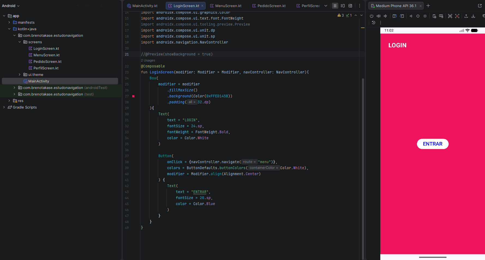
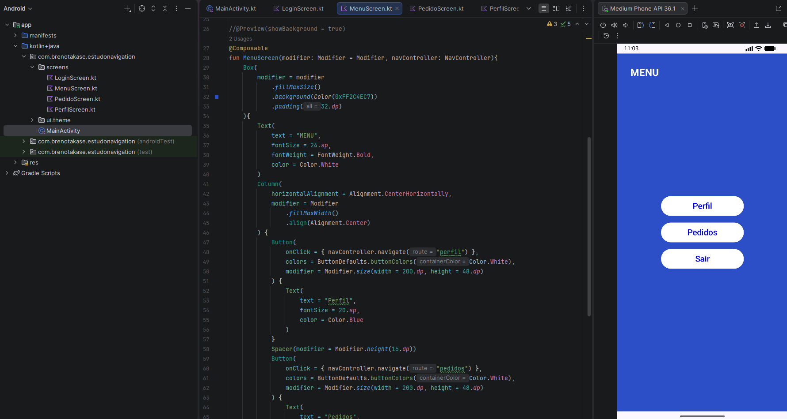
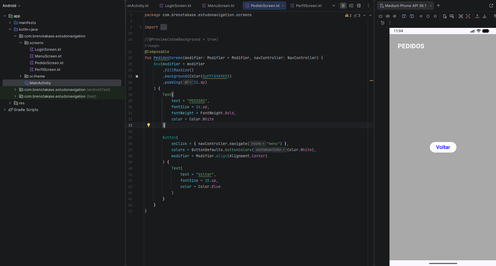
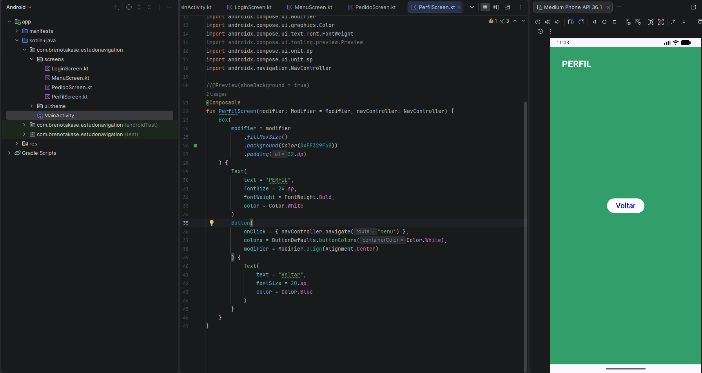

# Descrição do Projeto:
Este projeto é uma aplicação Android desenvolvida com Kotlin e Jetpack Compose, focada em demonstrar a implementação de um fluxo de navegação multi-telas.

## Telas do Aplicativo:

